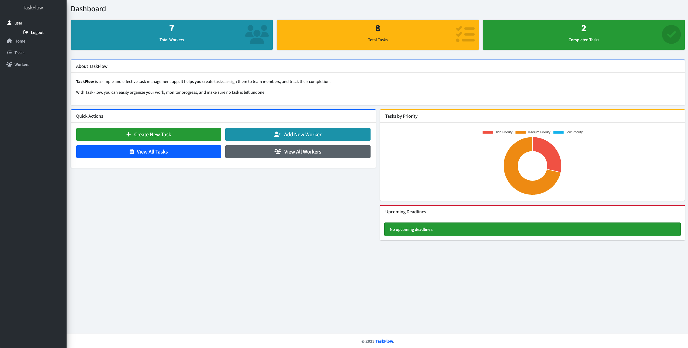

# TaskFlow

TaskFlow is a simple and effective task management app.

## Check it out!

[TaskFlow Project Deployed to Render](https://task-flow-n42w.onrender.com)

## Installation

Python3 must be already installed

```bash
git clone https://github.com/VPiliaiev/task-flow.git
cd task-flow
python3 -m venv venv
source venv/bin/activate
pip install -r requirements.txt
python manage.py runserver  # start Django Server
```
## Features

* Authentication – for Worker/User
* Task Creation & Tracking – easily create and monitor tasks
* Worker Management – manage employees and assign tasks

## Test User

You can log in with the following test account:
* `Login:` user  
* `Password:` user12345


